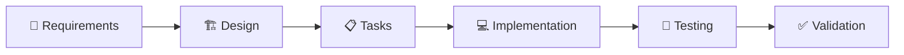

<div align="center">

# 🐍 Snake Game with AI Controller

[](https://opensource.org/licenses/MIT)
[](#testing-infrastructure)
[](#testing-infrastructure)
[](#ai-controller)
[](#spec-driven-development)

## 🎮 Live Demo
 
 <iframe
  src="https://guruvardhan-tech-village.github.io/AWS_kiro_AI_snake_game/"
  width="600"
  height="400"
  title="Snake Game Live Preview"
  frameborder="0"
  allowfullscreen
></iframe>

**A professionally developed Snake Game featuring intelligent AI controller, comprehensive testing suite, and modern development practices**

[🎮 **Play Game**](index.html) • [🧪 **Run Tests**](final-test.html) • [📋 **View Specs**](.kiro/specs/snake-game/) • [📖 **Documentation**](TESTING.md)

</div>

---

## 📖 **Overview**

This Snake Game represents a modern approach to classic game development, combining traditional gameplay with cutting-edge development methodologies. Built using **spec-driven development**, the project showcases professional software engineering practices including comprehensive testing, AI implementation, and formal specification processes.

### 🎯 **Key Features**

```
🎮 Classic Snake Gameplay    🤖 Intelligent AI Controller    🧪 Comprehensive Testing
🎨 Modern Visual Design      📋 Spec-Driven Development     🚀 Zero Dependencies
```

---

## � **Gamed Features**

<table>
<tr>
<td width="50%">

### **Core Gameplay**
- ✅ **Classic Mechanics**: Traditional Snake game with modern enhancements
- ✅ **Screen Wrapping**: Snake seamlessly moves through boundaries
- ✅ **Score System**: Real-time score tracking and food consumption
- ✅ **Collision Detection**: Precise self-collision and boundary handling
- ✅ **Smooth Controls**: Responsive arrow key navigation

</td>
<td width="50%">

### **AI Controller**
- 🤖 **Smart Pathfinding**: Manhattan distance-based optimal routing
- 🧠 **Collision Avoidance**: Intelligent self-collision prevention
- 🎯 **Strategic Planning**: Safety-first decision making algorithms
- 🔄 **Adaptive Behavior**: Dynamic response to complex scenarios
- ⚡ **Real-time Switching**: Seamless manual/AI mode transitions

</td>
</tr>
</table>

### **Visual Design**
- 🎨 **Retro Aesthetic**: Classic green snake with rounded segments
- 🍓 **Detailed Graphics**: Berry food with decorative leaf elements
- 🖥️ **Clean Interface**: Minimalist design with intuitive controls
- � ***Optimized Layout**: 400x400 game area with responsive design

---

## 🧪 **Testing Infrastructure**

<div align="center">

### **Test Statistics**

| **Metric** | **Value** | **Description** |
|------------|-----------|-----------------|
| **Total Tests** | 43 | Complete test coverage |
| **Unit Tests** | 32 | Specific functionality validation |
| **Property Tests** | 12 | Universal correctness properties |
| **Pass Rate** | 100% | All tests passing |
| **Iterations** | 100+ | Per property test execution |

</div>

### **Testing Categories**

<table>
<tr>
<td width="33%">

**🎮 Game Systems**
- Game Initialization
- Movement System
- Food System
- Score System

</td>
<td width="33%">

**🤖 AI Systems**
- Pathfinding Algorithms
- Safety Prioritization
- Decision Making
- Mode Switching

</td>
<td width="33%">

**🔧 Control Systems**
- Keyboard Input
- Direction Changes
- Collision Detection
- State Management

</td>
</tr>
</table>

### **Testing Frameworks**

- **🏗️ Custom Browser Framework**: Jest-like API without Node.js dependencies
- **🎲 Property-Based Testing**: fast-check-like implementation for universal validation
- **🛠️ Game State Utilities**: Comprehensive helpers for test scenario creation
- **📊 Multiple Test Runners**: Various interfaces for different testing needs

---

## 📋 **Spec-Driven Development**

This project exemplifies **Kiro's spec-driven development methodology**, following a structured approach from requirements to implementation:

<div align="center">



</div>

### **Development Artifacts**

| **Document** | **Purpose** | **Content** |
|--------------|-------------|-------------|
| **[Requirements](/.kiro/specs/snake-game/requirements.md)** | Functional Specification | EARS patterns, INCOSE compliance, testable criteria |
| **[Design](/.kiro/specs/snake-game/design.md)** | Technical Architecture | Components, algorithms, correctness properties |
| **[Tasks](/.kiro/specs/snake-game/tasks.md)** | Implementation Plan | 14 structured tasks, incremental development |

---

## 🏗️ **Project Architecture**

<details>
<summary><strong>📁 Project Structure</strong></summary>

```
snake-game/
├── 🎮 Game Files
│   ├── index.html              # Main game interface
│   ├── script.js               # Game logic + AI controller
│   └── style.css               # Game styling
│
├── � Testting Suite
│   ├── tests/
│   │   ├── unit-tests.js       # 32 unit tests
│   │   ├── property-tests.js   # 12 property-based tests
│   │   └── README.md           # Test documentation
│   │
│   ├── test-framework.js       # Custom testing framework
│   ├── property-testing.js     # Property-based testing engine
│   ├── test-utils.js           # Game state utilities
│   │
│   └── Test Runners
│       ├── final-test.html     # Complete test suite
│       ├── test.html           # Main test runner
│       └── [debug-tools].html  # Various debug utilities
│
├── 📋 Specifications
│   └── .kiro/specs/snake-game/
│       ├── requirements.md     # Feature requirements
│       ├── design.md           # Technical design
│       └── tasks.md            # Implementation tasks
│
└── 📖 Documentation
    ├── README.md               # This file
    ├── TESTING.md              # Testing documentation
    └── package.json            # Project metadata
```

</details>

---

## 🎯 **Technical Highlights**

### **🤖 AI Algorithm Implementation**

<table>
<tr>
<td width="50%">

**Pathfinding Strategy**
- Manhattan Distance Calculation
- Optimal route determination
- Multi-step lookahead planning
- Dynamic path recalculation

</td>
<td width="50%">

**Safety Mechanisms**
- Collision prediction algorithms
- Safe move prioritization
- Trap detection and avoidance
- Emergency fallback strategies

</td>
</tr>
</table>

### **🧪 Property-Based Testing**

- **Universal Validation**: Tests properties across all possible game states
- **Randomized Input Generation**: 100+ iterations per property test
- **Formal Correctness Properties**: Mathematical specifications for game behavior
- **Automatic Edge Case Discovery**: Systematic boundary condition testing

### **🌐 Browser Compatibility**

- **Pure JavaScript**: Zero external dependencies
- **Modern Web APIs**: Canvas 2D, keyboard events, DOM manipulation
- **Cross-Browser Support**: Compatible with all modern browsers
- **No Build Process**: Direct execution without compilation

---

## 🚀 **Quick Start Guide**

### **🎮 Playing the Game**

1. **Launch**: Open `index.html` in any modern web browser
2. **Manual Control**: Use arrow keys (↑↓←→) to control the snake
3. **AI Mode**: Click "AI Mode" button to watch intelligent gameplay
4. **Challenge**: Try to beat the AI's score in manual mode!

### **🧪 Running Tests**

1. **Complete Suite**: Open `final-test.html` for full test execution
2. **Interactive Runner**: Open `test.html` for detailed test interface
3. **Quick Verification**: Open `minimal-test.html` for rapid testing
4. **No Setup Required**: All tests run directly in browser

### **💻 Development Setup**

1. **Source Code**: All logic in plain JavaScript/HTML/CSS
2. **Game Logic**: Modify `script.js` for gameplay changes
3. **Testing**: Update tests in `tests/` directory
4. **Specifications**: Follow spec-driven development in `.kiro/specs/`

---

## 🏆 **Project Achievements**

<div align="center">

| **Achievement** | **Status** | **Description** |
|-----------------|------------|-----------------|
| **100% Test Coverage** | ✅ | All functionality comprehensively validated |
| **Property-Based Testing** | ✅ | Universal correctness guarantees implemented |
| **AI Controller** | ✅ | Intelligent automated gameplay system |
| **Spec-Driven Development** | ✅ | Complete requirements → design → implementation |
| **Zero Dependencies** | ✅ | Pure browser-based implementation |
| **Educational Value** | ✅ | Demonstrates modern development practices |

</div>

---

## 🤝 **Contributing & Learning**

This project serves as an educational example of:

- **🧪 Test-Driven Development**: Comprehensive validation strategies
- **🎲 Property-Based Testing**: Universal correctness verification
- **🤖 AI Algorithm Implementation**: Pathfinding and decision-making systems
- **📋 Spec-Driven Development**: Formal specification methodologies
- **🌐 Browser-Based Game Development**: Framework-free implementation

### **Development Principles Demonstrated**

- Formal specification before implementation
- Comprehensive testing at multiple levels
- Clean, maintainable code architecture
- Professional documentation practices
- Modern software engineering methodologies

---

## 📄 **License & Attribution**

**MIT License** - Open source implementation available for educational and commercial use.

Feel free to explore, modify, and learn from this professional implementation of classic Snake gameplay enhanced with modern development practices.

---

<div align="center">

**🚀 Built with [Kiro's](https://kiro.ai) spec-driven development methodology**

*Demonstrating how formal specifications, comprehensive testing, and intelligent design create robust, maintainable software*

[🎮 Play Now](index.html) • [🧪 Test Suite](final-test.html) • [📋 Specifications](.kiro/specs/snake-game/)

</div>
